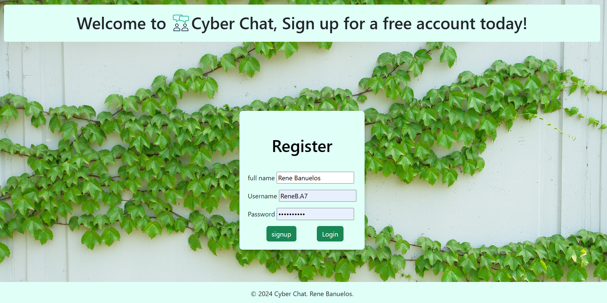
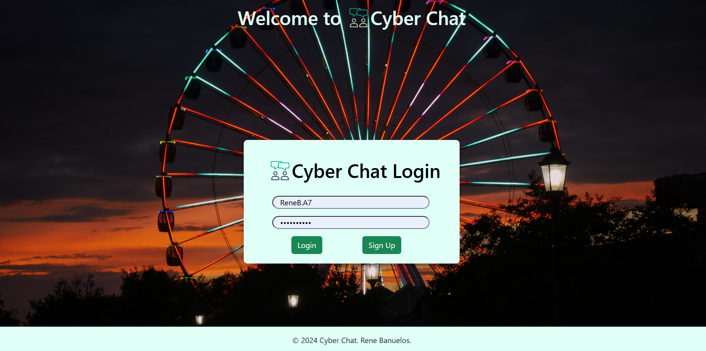
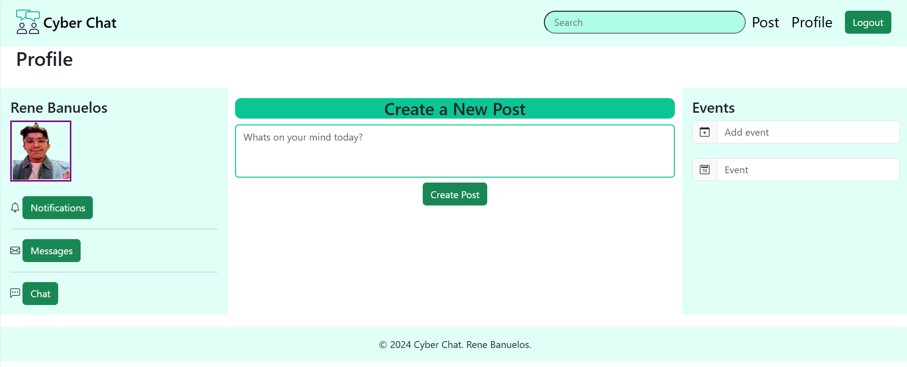
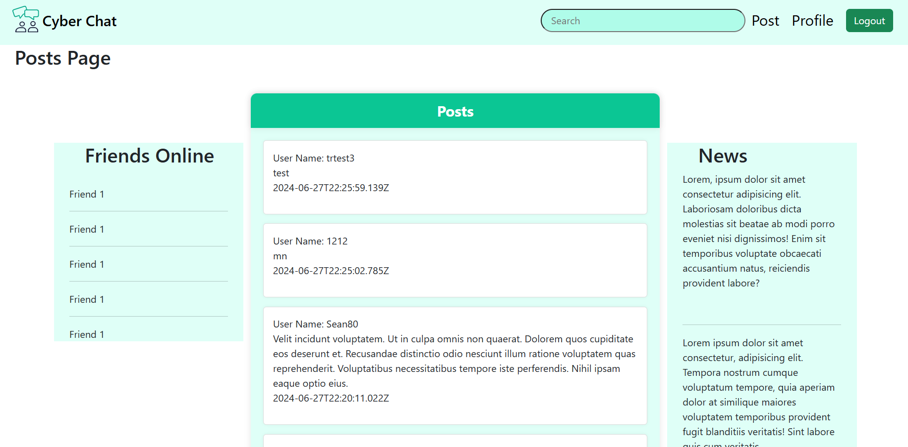
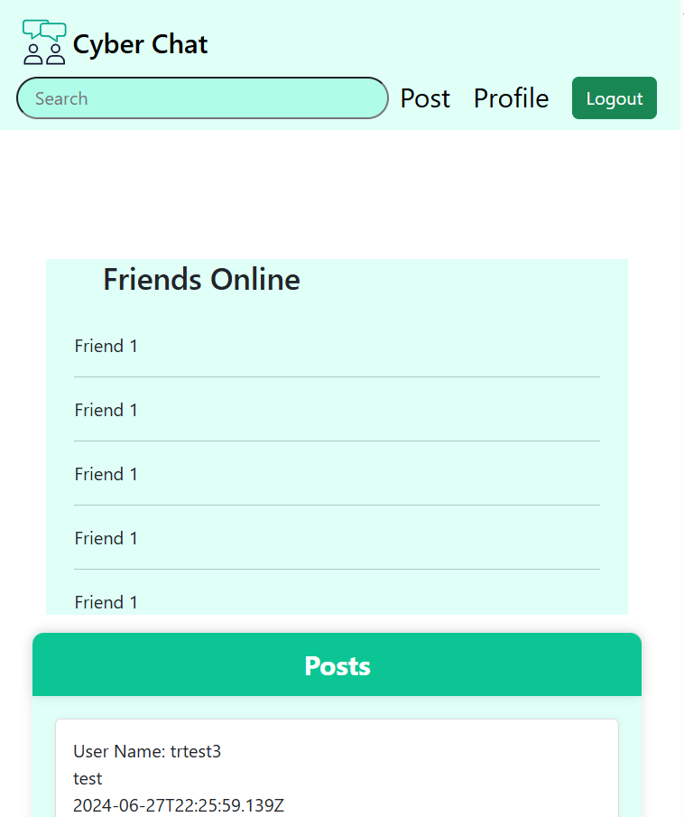
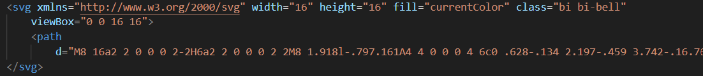

# Capstone3
 Capstone3
This is my microblog network web project. It consists of a few pages which includes a index login page, registration signup page,
 a page which displays posts, aswell as a profile page.

# registration page

    
     
    <h5>Minimized screen<h5>
    
 

# login page

    
      
    <h5>Minimized screen<h5>
    

# profile page

    
     
    <h5>Minimized screen<h5>
    

# posts page

    
     
    <h5>Minimized screen<h5>
    

#

One interesting piece of code within this project. I'd say is the incorporation of the icons to my profile page. I uploaded them to my profile page via an svg tag

 

    
 
